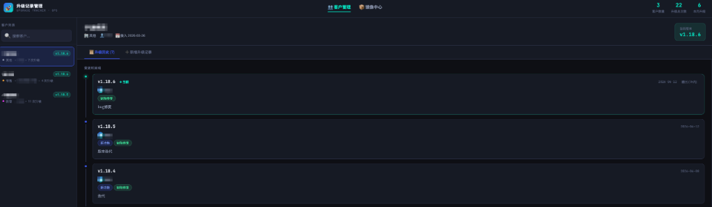

# 客户升级记录管理系统

Go + MySQL 后端，单页前端，开箱即用。



## 目录结构

```
upgrade-tracker/
├── cmd/server/main.go          # 程序入口
├── internal/
│   ├── config/config.go        # 配置加载
│   ├── db/db.go                # MySQL 连接
│   ├── model/model.go          # 数据模型
│   ├── repo/                   # 数据库操作
│   │   ├── client.go           # 客户数据操作
│   │   ├── upgrade.go          # 升级历史数据操作
│   │   └── image.go            # 镜像数据操作
│   └── handler/handler.go      # HTTP 路由 & 处理
├── frontend/
│   ├── index.html              # 前端主页（展示与客户升级记录查询）
│   └── admin.html              # 超级管理后台
├── sql/init.sql                # 建表 + 示例数据
├── config.yaml                 # 配置文件 ← 改这里
├── go.mod
└── Makefile
```

## 快速启动

### 第一步：初始化数据库

```bash
mysql -u root -p < sql/init.sql
```

### 第二步：修改配置

编辑 `config.yaml`，填入你的 MySQL 连接信息：

```yaml
database:
  host:     localhost
  port:     3306
  user:     root          # ← 你的用户名
  password: your_password # ← 你的密码
  name:     upgrade_tracker
```

### 第三步：安装依赖 & 启动

```bash
# 安装 Go 依赖
make deps

# 启动服务
make run
```

浏览器访问：**http://localhost:18881**

### 编译为可执行文件（可选）

```bash
make build
./upgrade-tracker-server
```

## API 说明

### 👥 客户与升级 API
| 方法   | 路径                                  | 说明         |
|--------|---------------------------------------|--------------|
| GET    | /api/clients                          | 客户列表     |
| POST   | /api/clients                          | 新增客户     |
| GET    | /api/clients/:id                      | 客户详情     |
| PUT    | /api/clients/:id                      | 编辑客户     |
| DELETE | /api/clients/:id                      | 删除客户     |
| GET    | /api/clients/:id/upgrades             | 升级记录列表 |
| POST   | /api/clients/:id/upgrades             | 新增升级记录 |
| DELETE | /api/clients/:id/upgrades/:uid        | 删除升级记录 |

### 📦 产品镜像 API
| 方法   | 路径                                  | 说明         |
|--------|---------------------------------------|--------------|
| GET    | /api/images                           | 镜像列表     |
| POST   | /api/images                           | 新增镜像     |
| GET    | /api/images/:id                       | 镜像详情     |
| PUT    | /api/images/:id                       | 编辑镜像     |
| DELETE | /api/images/:id                       | 删除镜像     |

### 🩺 系统 API
| 方法   | 路径                                  | 说明         |
|--------|---------------------------------------|--------------|
| GET    | /api/health                           | 健康检查     |

## 环境变量（可替代 config.yaml）

```bash
export DB_HOST=localhost
export DB_PORT=3306
export DB_USER=root
export DB_PASSWORD=your_password
export DB_NAME=upgrade_tracker
```

## 后台管理

本系统内置了一个轻量级的管理后台，用于管理客户信息和产品发布镜像。

- **访问地址**：`http://localhost:18881/admin.html`
- **默认管理密码**：`admin123`（可在 [admin.html](file:///Users/langtu/Desktop/douyy/upgrade-tracker/frontend/admin.html#L361) 中进行修改）

### 核心功能
1. **👥 客户管理**
   - 查看与编辑客户信息（名称、行业、联系人、备注）。
   - 查看与管理（删除）每个客户的历史升级版本记录。
   - 删除客户（将级联删除该客户的所有升级历史）。
2. **📦 产品镜像管理**
   - 记录和维护产品版本镜像包信息（支持 Docker 镜像、压缩包、可执行文件等类型）。
   - 登记公网下载地址 (如阿里云 ACR/OSS) 与内网下载地址 (如内部 Harbor)。
   - 保存和快速复制部署配置说明/启动命令（如 `docker run` 命令等）。

